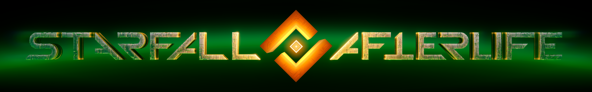

## О Проекте
Starfall Afterlife — это альтернативный лончер для Starfall Online, позволяющий запускать игру локально или создавать собственные серверы. Целью проекта является сохранение возможности запуска и полноценной игры в Starfall после закрытия официальных серверов.

## Установка
1. [Устанавливаем лончер](https://github.com/MenY-dev/StarfallAfterlife/releases/latest/download/starfall-afterlife-setup-win-x64.msi) *(он может попросить установить .net 8)*
2. [Распаковываем архив с игрой](https://discord.com/channels/202592394539958274/468629996571983876/1199336205184159885) в удобное место
3. Запускаем ранее установленный лончер.
4. Нажимаем кнопку "Играть"
5. Лончер предложит  выбрать файлы игры - указываем ему файлы игры, которые мы распаковали ранее
6. Далее лончер предложит создать профиль и мир игры

    ### 🚀Игра запущена 🚀

Вся эта процедура необходима только при первом запуске игры.
 
*Также игра после запуска может попросить установить недостающие компоненты, нужно соглашаться.*

## Загрузить
[Лончер](https://github.com/MenY-dev/StarfallAfterlife/releases/latest/download/starfall-afterlife-setup-win-x64.msi)
 
[Архив игры](https://discord.com/channels/202592394539958274/468629996571983876/1199336205184159885)
 
[.NET 8.0 Desktop Runtime](https://dotnet.microsoft.com/en-us/download/dotnet/thank-you/runtime-desktop-8.0.27-windows-x64-installer)

## Поддержать Автора

## Ссылки
[Сообщество игры в Discord](https://discord.gg/starfallonline)
 
[Сообщество игры в Steam](https://steamcommunity.com/app/460570)
